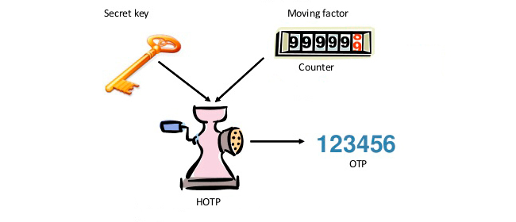

# Implementation of a TOTP (Time-based One-Time Password) system

In this project, the aim is to implement a TOTP (Time-based One-Time Password) system, which will be capable of generating ephemeral passwords from a master key using the HOTP algorithm (RFC 4226).

HOTP is HMac OTP ( Hashed Message Authentication Code )


The program must repeat the behaviour of:
```
oathtool --totp $(cat key.txt)
```


## Usage
to activate/deactivate a virtual python environment
```
source .venv/bin/activate
deactivate
```

make the python file executable
```
chmod +x ft_otp
```

run the program
usage
```
./ft_otp -g key.txt
./ft_otp -k ft_otp.key
```
`-g`: the program receives as argument a hexadecimal key of at least 64 characters. The program stores this key safely in a file called ft_otp.key, which is encrypted
`-k`: the program generates a new temporary password based on the key given as argument and prints it on the standard output

The content of `key.txt` can be modified


## HOTP implementation

```
HOTP(K,C) = Truncate(HMAC-SHA-1(K,C))
```
Where K = initial key from arguments
    C = counter

SHA-1 HMAC Bytes (Example)

| Byte Number | 00 | 01 | 02 | 03 | 04 | 05 | 06 | 07 | 08 | 09 | 10 | 11 | 12 | 13 | 14 | 15 | 16 | 17 | 18 | 19 |
|-------------|----|----|----|----|----|----|----|----|----|----|----|----|----|----|----|----|----|----|----|----|
| Byte Value  | 1f | 86 | 98 | 69 | 0e | 02 | ca | 16 | 61 | 85 | 50 | ef | 7f | 19 | da | 8e | 94 | 5b | 55 | 5a |
| Selected    |    |    |    |    |    |    |    |    |    |    |    | **ef** | **7f** | **19** | **da** |    |    |    |    |    |

#### 1. HMAC-SHA1
generate hmac hash from key and counter ( current time )
HMAC-SHA1 specifically utilizes the SHA-1 algorithm as its hashing function
To implement HMAC-SHA1 in Python, you can utilize the hmac and hashlib libraries to obtain 20 bytes(160 bits) 

#### 2. Dynamic Truncation

Take last byte `5a`= `01011010` and its 4 last bites `1010` to get an offset `10`
Take 4 bytes from hash from index=offset(10) to index=offset+4(14)

#### 3. Transformation to number

Cast to int and make first bite 0 to make it positive
Make it the right length


### Useful links

[Stephane Robert: MFA](https://blog.stephane-robert.info/docs/services/identite/fondamentaux/mfa-webauthn/)
[dev: 2-Factor Authentication OTP](https://dev.to/dmitrevnik/build-your-own-authenticator-totp-vs-hotp-explained-2315)
[hmac functions](https://docs.python.org/3/library/hmac.html)
[RFC 4226](https://datatracker.ietf.org/doc/html/rfc4226#section-5.1)